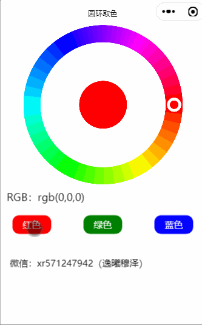

## 圆环取色效果图（gif图有些失真）

## 序
1、之前做过一个web版的js圆环取色，没有做触摸动作，只做了点击取色；
2、也做过小程序的圆环取色，是用了一张图片来做底层的，然后根据中心点以360度角取色色值转换RGB；

## 实现

#### 当前小程序实现了：

1. 圆环触摸移动获取颜色；
2. 点击获取颜色；
3. 点击指定的颜色来跳到对应的位置；

孤独常伴左右，思考照亮认知，最后，共勉，大地！

## 交流
悲情的色彩酒中流，孤独的欢乐谈笑中；
美酒怀中揽最思人，喜悦心间露动人心。
